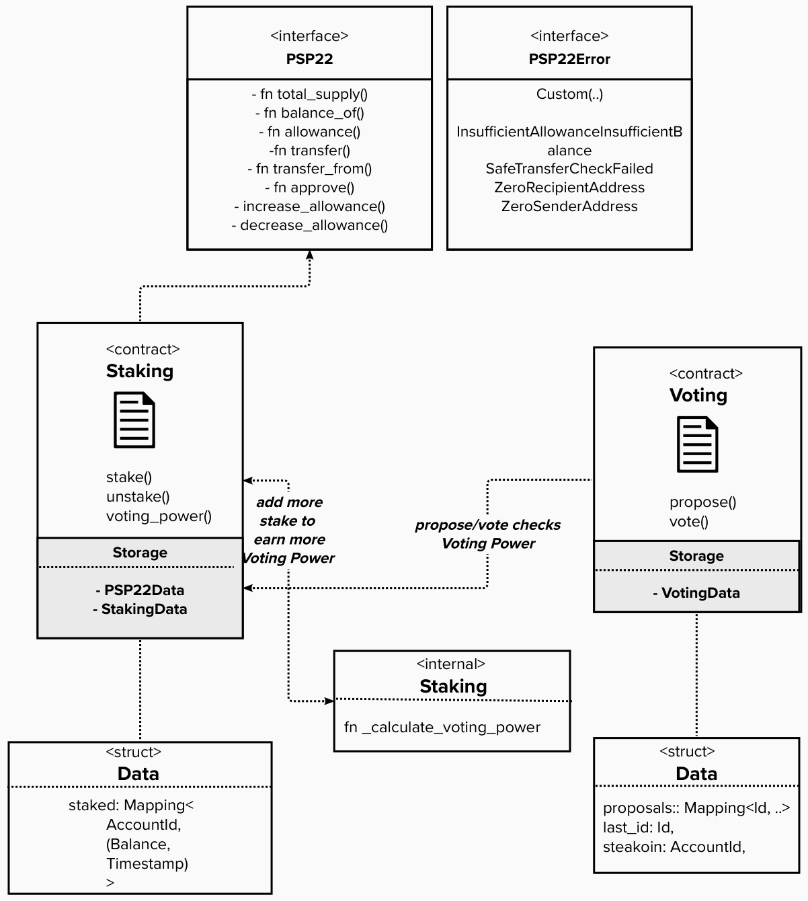

## Application design and overview

This tutorial can be completed in 3 sections, each section building on one another:

* The first section will be about building the P2P22 Staking contract and it’s custom functionality. Our Voting dapp’s logic is based on the fact that users need to acquire this special PSP22 token in order to vote or propose items to be voted on which for simplicity. We also assume that the tokens will be distributed by the contract owner.

* In the second section, we'll create a separate Voting contract which can make call to the Staking contract. We’ll also write tests for both contracts. 

* In the third and last section, we’ll add a front-end that will allow users to vote on proposals.

<!-- slide:break -->

<!-- tabs:start -->

  
  

 

*Overview of the architecture of the Voting dApp we're building.*

<!-- tabs:end -->