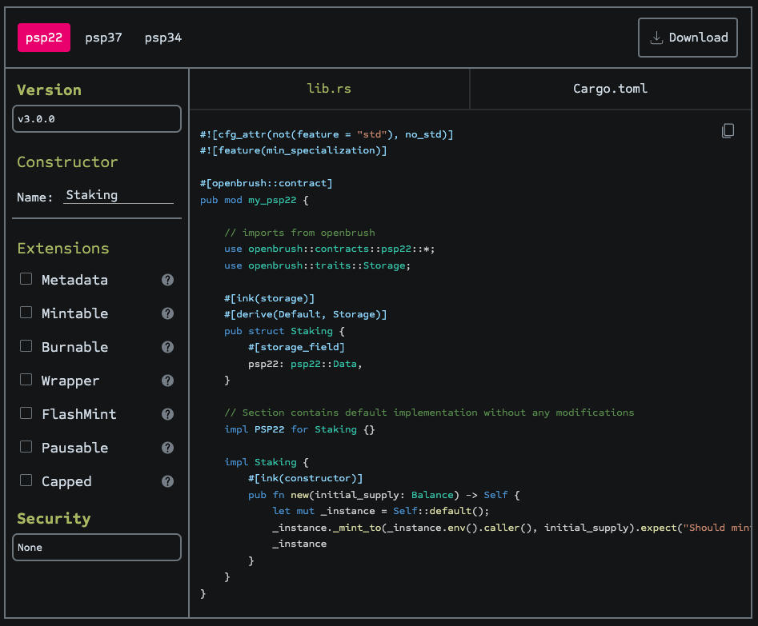
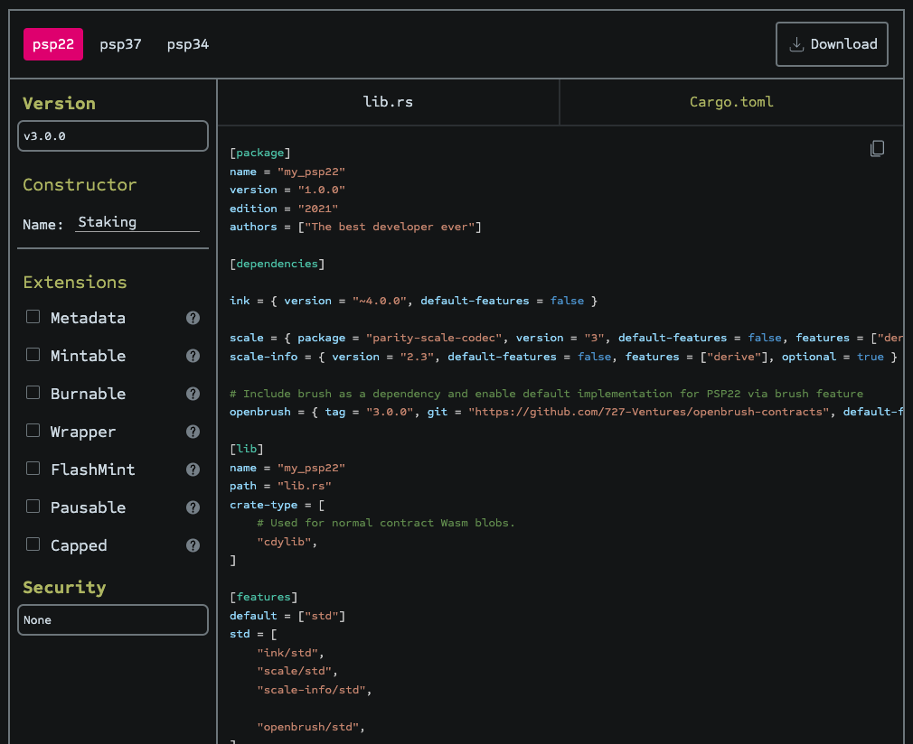

# Start with a default PSP22 contract implementation 

OpenBrush comes with a PSP22 Wizard to easily create default PSP implementations. Go to the OpenBrush Wizard by scrolling to the bottom of the https://openbrush.io/ homepage.  

Use the “Name” field to rename it to Staking, then paste it to replace the contents of contracts/staking/lib.rs.



Then, make sure to update the contract’s Cargo.toml by copying the contents provided by the PSP22 Wizard’s Cargo.toml section.



> **Note**: *the tutorial assumes you’re using ink! version >= 4.1.0 and OpenBrush version >= 3.1.0. You may need to double check the Cargo.toml files have these updated before moving on.*

You’ll notice that default implementation has a constructor. All it’s doing by default is to mint some arbitrary supply of tokens to the account instantiating the contract. Modify this so that it mints a fixed amount of 42_000_000 tokens by updating the impl Staking block to this: 

```rust
impl Staking {
        #[ink(constructor)]
        /// Mint a fixed supply of 42_000_000 Staking tokens.
        /// 
        /// Tokens are issued to the account instantiating this contract.
        pub fn new() -> Self {
            let mut _instance = Self::default();
						_instance
						    ._mint_to(_instance.env().caller(), 42_000_000 * 10u128.pow(18))
						    .expect("Should mint"); 
						_instance
			  }
    }
```

*File: `contracts/staking/lib.rs`. Note that we account for the decimals for denominations using `10u128.pow(18)`.*

Before moving to the next step, run `cargo contract check` inside the Staking contract directory to make sure it compiles. Doesn’t compile? Check your `Cargo.toml` file is using the right dependency versions. 😀

