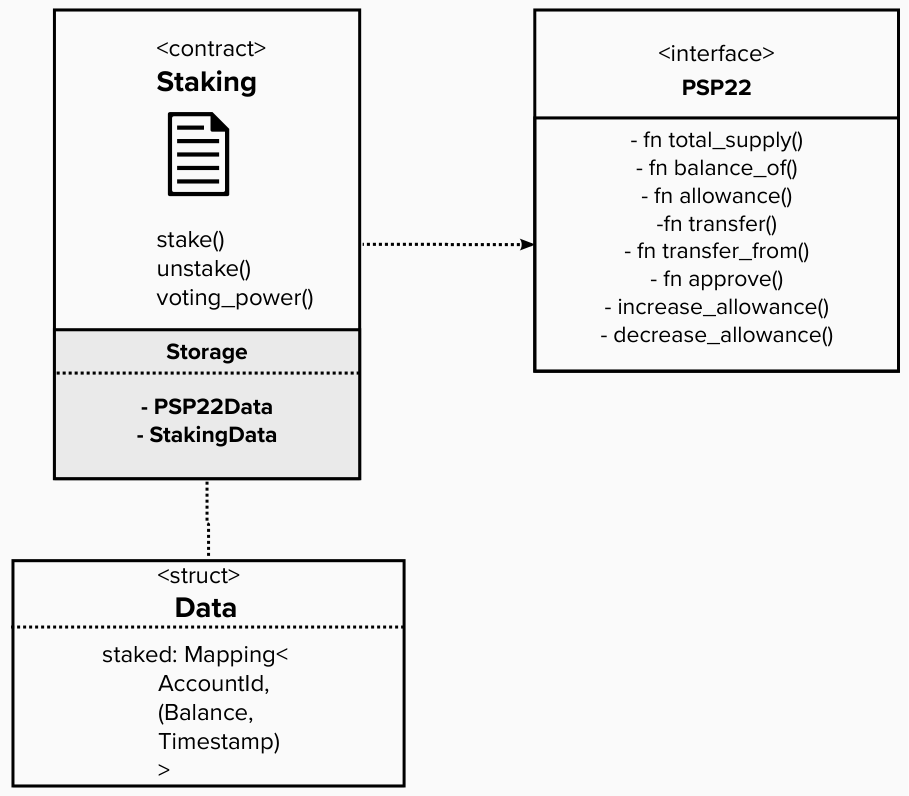

# Customize your contract

The way we’re using the PSP22 standard is much like the concept of inheritance in many programming languages. In the next few steps, we’ll use types and functions from the PSP22 standard to add custom functionality to our Staking contract. These include:

- `PSP22Data` : We already have the storage item for `PSP22Data` declared in the Staking storage field, which holds all data from the standard PSP22 implementation.
- `transfer_from` and `transfer`: We will need these when we extend our staking contract to implement `stake` and `unstake` respectively.



### Add a trait definition for Staking

A common pattern in developing ink! contracts with OpenBrush is to first define your traits and then implement them in their own modules. This keeps the project organized and easy to read.

1. In the `src/traits` folder of our project, create a Rust module called `[staking.rs](http://staking.rs)`.
2. In the `src/traits/mod.rs` file, make this module accessible to the rest of your project by adding:
    
    ```rust
    pub mod staking;
    ```
    
3. In the `[staking.rs](http://staking.rs)` file, add the following code :
    
    ```rust
    pub use openbrush::{
        contracts::psp22::*,
        traits::{
            AccountId,
            Balance,
        },
    };
    
    #[openbrush::wrapper]
    pub type StakingRef = dyn Staking + PSP22;
    
    #[openbrush::trait_definition]
    pub trait Staking {
        #[ink(message)]
        fn stake(&mut self, amount: Balance) -> Result<(), PSP22Error>;
    
        #[ink(message)]
        fn unstake(&mut self, amount: Balance) -> Result<(), PSP22Error>;
    
        #[ink(message)]
        fn voting_power(&self, account: AccountId) -> u128;
    }
    ```
    
    In the above code, we’ve added the function signatures that we’ll need for the Staking trait as well as the other PSP22 imports. Just like declaring any publicly callable function in an ink! contract, notice how each function signature is annotated with `#[ink(message)]`. This ensures that the methods in this trait are callable when we implement it for the staking contract. 
    
    You’ll also notice that OpenBrush is doing some macro magic for us too:
    
    - `#[openbrush::wrapper]` : this provides a wrapper around the storage declaration to pass it into our ink! contract.
    - `#[openbrush::traits]`: this allows us to define a trait in a separate file that can be used by our generic Staking contract.